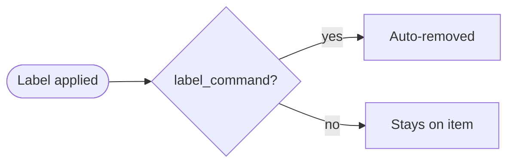
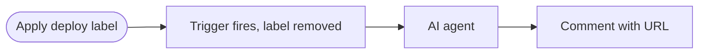
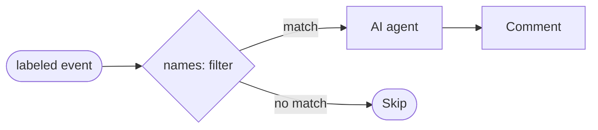

LabelOps uses GitHub labels as workflow triggers, metadata, and state markers. GitHub Agentic Workflows supports two distinct approaches to label-based triggers: [`label_command`](/gh-aw/reference/command-triggers/) for command-style one-shot activation, and `names:` filtering for persistent label-state awareness.


The `label_command` trigger treats a label as a one-shot command: applying the label fires the workflow, and the label is **automatically removed** so it can be re-applied to re-trigger. This is the right choice when you want a label to mean "do this now" rather than "this item has this property."

## Example: Deploy Preview

This workflow triggers when a `deploy` label is applied to a pull request. It builds and deploys a preview environment, then posts the URL as a comment. The workflow runs with read-only permissions while [safe-outputs](/gh-aw/reference/safe-outputs/) handle the comment creation securely.



Example workflow:

```aw wrap
---
on:
  label_command: deploy
permissions:
  contents: read
safe-outputs:
  add-comment:
    max: 1
---

# Deploy Preview

A `deploy` label was applied to this pull request. Build and deploy a preview environment and post the URL as a comment.

The matched label name is available as `${{ needs.activation.outputs.label_command }}` if needed to distinguish between multiple label commands.
```

After activation the `deploy` label is removed from the pull request, so a reviewer can apply it again to trigger another deployment without any cleanup step.

### Syntax

`label_command` accepts a shorthand string, a map with a single name, or a map with multiple names and an optional `events` restriction:

```yaml
# Shorthand — fires on issues, pull_request, and discussion
on: "label-command deploy"

# Map with a single name
on:
  label_command: deploy

# Restrict to specific event types
on:
  label_command:
    name: deploy
    events: [issues, pull_request]

# Multiple label names
on:
  label_command:
    names: [deploy, redeploy]
    events: [pull_request]

# Keep label after activation (persistent state, not one-shot command)
on:
  label_command:
    name: in-review
    remove_label: false
```

The `remove_label` field (boolean, default `true`) controls whether the matched label is removed after the workflow activates. Set it to `false` when the label represents a persistent state rather than a transient command — for example, to mark that an item is currently being processed without consuming the label. When `remove_label: false`.

The compiler generates `issues`, `pull_request`, and/or `discussion` events with `types: [labeled]`, filtered to the named labels. It also adds a `workflow_dispatch` trigger with an `item_number` input so you can test the workflow manually without applying a real label.

### Accessing the matched label

The label that triggered the workflow is exposed as an output of the activation job:

```
${{ needs.activation.outputs.label_command }}
```

This is useful when a workflow handles multiple label commands and needs to branch on which one was applied.

### Combining with slash commands

`label_command` can be combined with `slash_command:` in the same workflow. The two triggers are OR'd — the workflow activates when either condition is met:

```yaml
on:
  slash_command: deploy
  label_command:
    name: deploy
    events: [pull_request]
```

This lets a workflow be triggered both by a `/deploy` comment and by applying a `deploy` label, sharing the same agent logic.

## Label Filtering

Use `names:` filtering when you want the workflow to run whenever a label is present on an item and the label should remain attached. This is suitable for monitoring label state rather than reacting to a transient command.

GitHub Agentic Workflows allows you to filter `labeled` and `unlabeled` events to trigger only for specific label names using the `names` field:

```aw wrap
---
on:
  issues:
    types: [labeled]
    names: [bug, critical, security]
permissions:
  contents: read
  actions: read
safe-outputs:
  add-comment:
    max: 1
---

# Critical Issue Handler

When a critical label is added to an issue, analyze the severity and provide immediate triage guidance.

Check the issue for:
- Impact scope and affected users
- Reproduction steps
- Related dependencies or systems
- Recommended priority level

Respond with a comment outlining next steps and recommended actions.
```

This workflow activates only when the `bug`, `critical`, or `security` labels are added to an issue, not for other label changes. The labels remain on the issue after the workflow runs.



### Choosing between `label_command` and `names:` filtering

| | `label_command` | `names:` filtering |
|---|---|---|
| Label lifecycle | Removed automatically after trigger | Stays on the item |
| Re-triggerable | Yes — reapply the label | Only on the next `labeled` event |
| Typical use | "Do this now" commands | State-based routing |
| Supported items | Issues, pull requests, discussions | Issues, pull requests |

### Label Filter Syntax

The `names` field accepts a single label (`names: urgent`) or an array (`names: [priority, needs-review, blocked]`). It works with both `issues` and `pull_request` events, and the field is compiled into a conditional `if` expression in the final workflow YAML.

## Common LabelOps Patterns

| Pattern | Trigger Labels | Agent Response |
|---------|---------------|----------------|
| **Priority Escalation** | `P0`, `critical`, `urgent` | Analyze severity, notify leads, provide SLA guidance |
| **Label-Based Triage** | `needs-triage`, `triaged` | Suggest categorization, priority, affected components |
| **Security Automation** | Security labels | Check disclosure risks, trigger review process |
| **Release Management** | Release labels | Analyze timeline, identify blockers, draft release notes |

## AI-Powered LabelOps

- **Automatic Label Suggestions**: Analyze issues and apply labels for type, priority, and component. Use `safe-outputs.add-labels.allowed` to restrict which labels can be applied automatically.
- **Component Auto-Labeling**: Identify affected components from file paths, APIs, and UI elements, then apply relevant component labels.
- **Label Consolidation**: Schedule audits to identify duplicate, unused, and inconsistently named labels.

## Best Practices

- Use specific label names (`ready-for-review` not `ready`) to avoid unintended triggers.
- Document label meanings in a LABELS.md file or GitHub label descriptions.
- Limit automation scope with opt-in labels like `automation-enabled`.
- Use safe outputs for all write operations to maintain security.

## Related Documentation

- [IssueOps](/gh-aw/patterns/issue-ops/) — Issue-triggered workflows
- [ChatOps](/gh-aw/patterns/chat-ops/) — Slash command automation
- [Trigger Events](/gh-aw/reference/triggers/) — Complete trigger configuration including label filtering
- [Safe Outputs](/gh-aw/reference/safe-outputs/) — Secure write operations
- [Frontmatter Reference](/gh-aw/reference/frontmatter/) — Complete workflow configuration options
