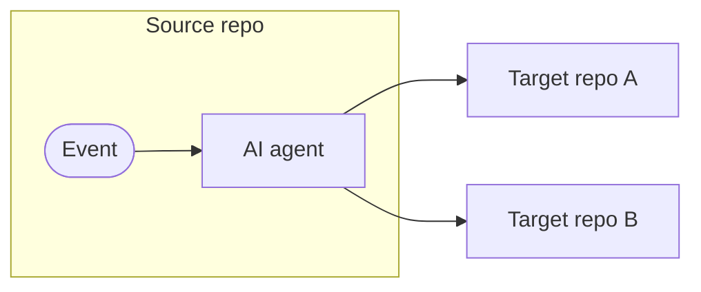

MultiRepoOps extends operational automation patterns (IssueOps, ChatOps, etc.) across multiple GitHub repositories. Using [cross-repository safe outputs](/gh-aw/reference/cross-repository/) and [secure authentication](/gh-aw/reference/auth/), MultiRepoOps enables coordinating work between related projects-creating tracking issues in central repos, synchronizing features to sub-repositories, and enforcing organization-wide policies-all through AI-powered workflows.



## When to Use MultiRepoOps

Use MultiRepoOps for feature synchronization (main repo to sub-repos), hub-and-spoke issue tracking (components → central tracker), org-wide enforcement (security patches, policy rollouts), and upstream/downstream feature sync.

## How It Works

MultiRepoOps workflows use the `target-repo` parameter on safe outputs to create issues, pull requests, and comments in external repositories. Combined with GitHub API toolsets for querying remote repos and proper authentication (PAT or GitHub App tokens), workflows can coordinate complex multi-repository operations automatically.

```aw wrap
---
on:
  issues:
    types: [opened, labeled]
permissions:
  contents: read
  actions: read
safe-outputs:
  github-token: ${{ secrets.GH_AW_CROSS_REPO_PAT }}
  create-issue:
    target-repo: "org/tracking-repo"
    title-prefix: "[component-a] "
    labels: [tracking, multi-repo]
---

# Cross-Repo Issue Tracker

When issues are created in component repositories, automatically create tracking issues in the central coordination repo.

Analyze the issue and create a tracking issue that:
- Links back to the original component issue
- Summarizes the problem and impact
- Tags relevant teams across the organization
- Provides context for cross-component coordination
```

## Authentication

Cross-repository operations require a PAT or GitHub App token. Set `github-token` on both `tools.github` (for reading from other repos) and `safe-outputs` (for writing to them). See [Authentication](/gh-aw/reference/auth/) for setup details — including token scoping, GitHub App installation tokens, and the `GH_AW_GITHUB_MCP_SERVER_TOKEN` convenience secret.

## Common MultiRepoOps Patterns

Three topologies cover most use cases:

| Pattern | Description |
|---------|-------------|
| **Hub-and-spoke** | Each component workflow creates tracking issues in a central repo via `target-repo` |
| **Upstream-to-downstream** | Main repo propagates changes using `create-pull-request` with `target-repo` per downstream |
| **Org-wide broadcast** | Single workflow creates issues in many repos up to the configured `max` limit |

## Cross-Repository Safe Outputs

Most safe output types support `target-repo` to write to external repositories, and `allowed-repos` for dynamic multi-target workflows. See [Cross-Repository Safe Outputs](/gh-aw/reference/cross-repository/#cross-repository-safe-outputs) for the complete list and configuration options, including `target-repo: "*"` for runtime-determined targets and the [GitHub Tools reference](/gh-aw/reference/cross-repository/#cross-repository-reading) for reading from private repositories.

## Deterministic Multi-Repo Workflows

For direct repository access without agent involvement, check out multiple repositories using `checkout:` frontmatter or `actions/checkout` steps. See the [Deterministic Multi-Repo example](/gh-aw/reference/cross-repository/#example-deterministic-multi-repo-workflows) in the cross-repository reference.

## Example Workflows

Explore detailed MultiRepoOps examples:

- **[Feature Synchronization](/gh-aw/examples/multi-repo/feature-sync/)** - Sync code changes from main repo to sub-repositories
- **[Cross-Repo Issue Tracking](/gh-aw/examples/multi-repo/issue-tracking/)** - Hub-and-spoke tracking architecture

## Best Practices

Use GitHub Apps over PATs for automatic token revocation; scope tokens minimally to target repositories. Set appropriate `max` limits and consistent label/prefix conventions. Test against public repositories first before rolling out to private or org-wide targets.

## Related Documentation

- [IssueOps](/gh-aw/patterns/issue-ops/) — Single-repo issue automation
- [ChatOps](/gh-aw/patterns/chat-ops/) — Command-driven workflows
- [CentralRepoOps](/gh-aw/patterns/central-repo-ops/) — Org-wide rollouts from a single control repo
- [Cross-Repository Operations](/gh-aw/reference/cross-repository/) — Checkout and `target-repo` configuration
- [Safe Outputs](/gh-aw/reference/safe-outputs/) — Complete safe output configuration
- [GitHub Tools](/gh-aw/reference/github-tools/) — GitHub API toolsets
- [Authentication](/gh-aw/reference/auth/) — PAT and GitHub App setup
- [Reusing Workflows](/gh-aw/guides/packaging-imports/) — Sharing workflows across repos
